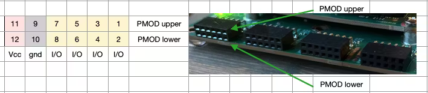
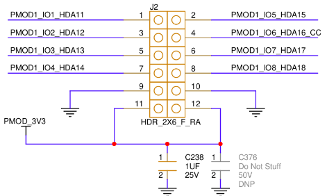
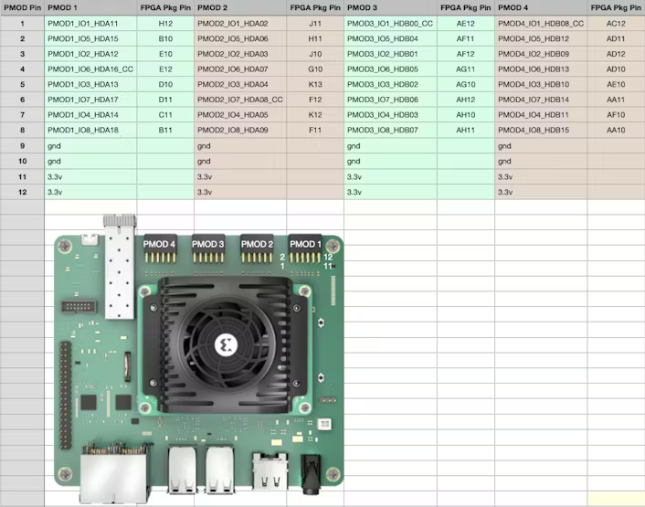
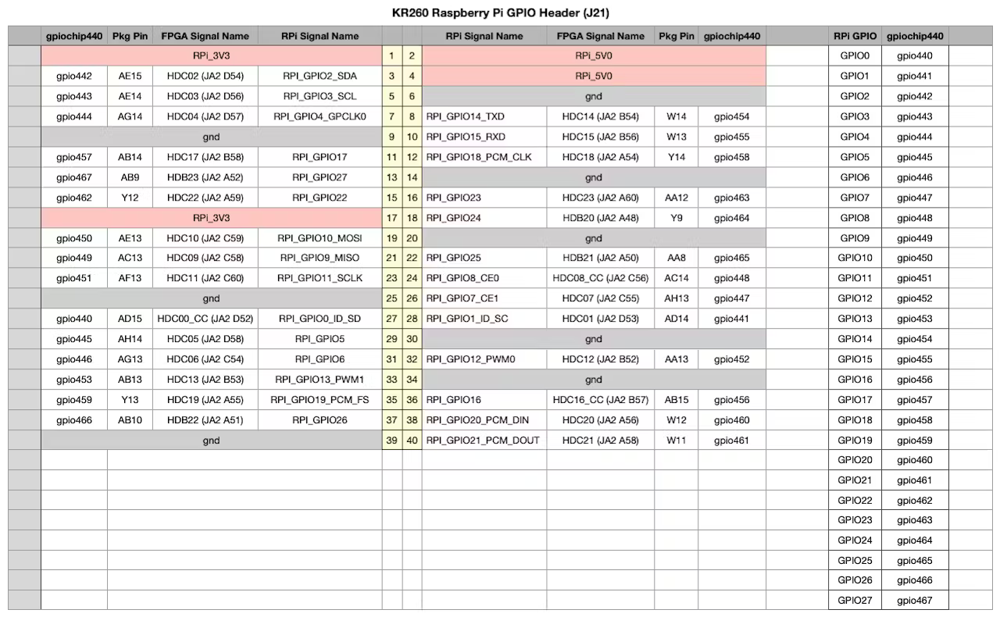

# Kria KR260 PMOD and RPI Pico I/O Mapping

### How it looks on the Board Itself

### The PMOD Schematic

### Table for PMOD Connections

| Pmod #     | SOM IO Name   | FPGA Pin |
|------------|:-------------:|---------:|
| pmod1_pin1 | som240_1_a17  |    H12   |
| pmod1_pin3 | som240_1_d20  |    E10   |
| pmod1_pin5 | som240_1_d21  |    D10   |
| pmod1_pin7 | som240_1_d22  |    C11   |
| pmod1_pin2 | som240_1_b20  |    B10   |
| pmod1_pin4 | som240_1_b21  |    E12   |
| pmod1_pin6 | som240_1_b22  |    D11   |
| pmod1_pin8 | som240_1_c22  |    B11   |

| Pmod #     | SOM IO Name   | FPGA Pin |
|------------|:-------------:|---------:|
| pmod2_pin1 | som240_1_d18  |    J11   |
| pmod2_pin3 | som240_1_b16  |    J10   |
| pmod2_pin5 | som240_1_b17  |    K13   |
| pmod2_pin7 | som240_1_b18  |    K12   |
| pmod2_pin2 | som240_1_c18  |    H11   |
| pmod2_pin4 | som240_1_c19  |    G10   |
| pmod2_pin6 | som240_1_c20  |    F12   |
| pmod2_pin8 | som240_1_a15  |    F11   |

| Pmod #     | SOM IO Name   | FPGA Pin |
|------------|:-------------:|---------:|
| pmod3_pin1 | som240_2_d44  |   AE12   |
| pmod3_pin3 | som240_2_d45  |   AF12   |
| pmod3_pin5 | som240_2_d46  |   AG10   |
| pmod3_pin7 | som240_2_d48  |   AH10   |
| pmod3_pin2 | som240_2_d49  |   AF11   |
| pmod3_pin4 | som240_2_d50  |   AG11   |
| pmod3_pin6 | som240_2_c46  |   AH12   |
| pmod3_pin8 | som240_2_c47  |   AH11   |

| Pmod #     | SOM IO Name   | FPGA Pin |
|------------|:-------------:|---------:|
| pmod4_pin1 | som240_2_c48  |   AC12   |
| pmod4_pin3 | som240_2_c50  |   AD12   |
| pmod4_pin5 | som240_2_c51  |   AE10   |
| pmod4_pin7 | som240_2_c52  |   AF10   |
| pmod4_pin2 | som240_2_b44  |   AD11   |
| pmod4_pin4 | som240_2_b45  |   AD10   |
| pmod4_pin6 | som240_2_b46  |   AA11   |
| pmod4_pin8 | som240_2_b48  |   AA10   |

### RPI Pico Header Pinout

| RPI Header Pin | SOM IO Name    | FPGA Pin | RPI_GPIO  |
|----------------|:--------------:|---------:|:---------:|
| 27             | som240_2_d52   |   AD15   |   0       |
| 28             | som240_2_d53   |   AD14   |   1       |
| 3              | som240_2_d54   |   AE15   |   2       |
| 5              | som240_2_d56   |   AE14   |   3       |
| 7              | som240_2_d57   |   AG14   |   4       |
| 29             | som240_2_d58   |   AH14   |   5       |
| 31             | som240_2_c54   |   AG13   |   6       |
| 26             | som240_2_c55   |   AH13   |   7       |
| 24             | som240_2_c56   |   AC14   |   8       |
| 21             | som240_2_c58   |   AC13   |   9       |
| 19             | som240_2_c59   |   AE13   |   10      |
| 23             | som240_2_c60   |   AF13   |   11      |
| 32             | som240_2_b52   |   AA13   |   12      |
| 33             | som240_2_b53   |   AB13   |   13      |
| 8              | som240_2_b54   |   W14    |   14      |
| 10             | som240_2_b56   |   W13    |   15      |
| 36             | som240_2_b57   |   AB15   |   16      |
| 11             | som240_2_b58   |   AB14   |   17      |
| 12             | som240_2_a54   |   Y14    |   18      |
| 35             | som240_2_a55   |   Y13    |   19      |
| 38             | som240_2_a56   |   W12    |   20      |
| 40             | som240_2_a58   |   W11    |   21      |
| 15             | som240_2_a59   |   Y12    |   22      |
| 16             | som240_2_a60   |   AA12   |   23      |
| 18             | som240_2_a48   |   Y9     |   24      |
| 22             | som240_2_a50   |   AA8    |   25      |
| 37             | som240_2_a51   |   AB10   |   26      |
| 13             | som240_2_a52   |   AB9    |   27      |

#### Image Credits
The images used in this README, including the PMOD layout, IO Mapping, and RPI Header Pinout, are sourced from the following article:

- **Article**: ["RPI Pmod Connector GPIO with Custom PL Design in Kria KR260"](https://www.hackster.io/whitney-knitter/rpi-pmod-connector-gpio-with-custom-pl-design-in-kria-kr260-53c40e) by Whitney Knitter, Hackster.io.
